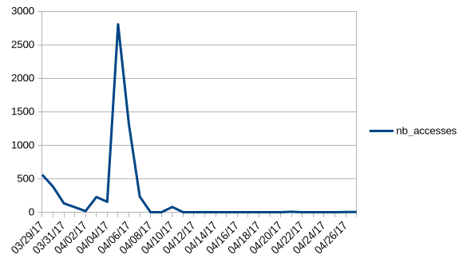

# ADS Lab 03 - Pipelines
**Authors**: Samuel Roland, Antoine Leresche, Nicolas Carbonara  
**Date**: 2025-03-10

## Task 1 - Exercises on redirection

1.  Run the following commands and tell where stdout and stderr are redirected to

- a. `./out > file`: stdout is redirected inside the file named `file`, and stderr stays on the screen
- b. `./out 2> file`: stderr is redirected inside the file named `file`, and stdout stays on the screen
- c. `./out > file 2>&1`: both stdout and stderr redirected to `file`
- d. `./out 2>&1 > file`: stdout is redirected inside the `file` and stderr is displayed on the screen
- e. `./out &> file`: both stdout and stderr are redirected to the `file`

2. What do the following commands do?

Note: this is not easy to describe file descriptors digits movements, we tried our best, based on the `Moving File Descriptors` section of `man bash`.

- a. `cat /usr/share/doc/cron/README | grep -i edit`: List all edit occurrences in the cron README with case insensitive research (Both `EDIT` or `edit` do match).
- b. `./out 2>&1 | grep -i eeeee`: Change the stderr file descriptor digit to the one behind stdout and redirect stdout to `grep`'s stdin. (Finally, this just redirect both stdout and stderr to `grep`). And `grep` tries matching the string `eeeee` (`OEOEOEOEOE` is the input given to grep). The case is not sensitive. There is no match here, nothing is displayed in the console.
- c: `./out 2>&1 >/dev/null | grep -i eeeee`: Change the stderr file descriptor digit to the file descriptor of stdout, then redirect stdout to `/dev/null` to discard it, the pipe is then redirecting stdout to `grep`. (Finally, the original stderr is sent to `grep`). And `grep` tries matching the string `eeeee`. The case is not sensitive. The output `EEEEE` is fully matched by `grep` here.

3. Write commands to perform the following tasks:
- a. Produce a recursive listing, using ls, of files and directories in your home directory, including hidden files, in the file `/tmp/homefileslist`:
    ```sh
    ls -aR ~ > /tmp/homefileslist  
    ```
- b. Produce a (non-recursive) listing of all files in your home directory whose
names end in .txt, .md or .pdf, in the file `/tmp/homedocumentslist`. The command must not display an error message if there are no corresponding files:
    ```sh
    ls ~/*.{txt,md,pdf} 2> /dev/null > /tmp/homedocumentslist
    ```


## Task 2 - Log analysis
We have verified that the separator in the log files is a tab, `xxd` shows `0x09` which is actually the tab character in the ascii table.

1. How many log entries are in the file?

    ```sh
    wc -l ads_website.log
    ```
    ```
    2781 ads_website.log
    ```

    **2781 entries**

2. How many accesses were successful (server sends back a status of 200) and how many had an error of "Not Found" (status 404)?
    ```sh
    > cat ads_website.log | awk -F "\t" '{print $10}' | grep 200 | wc -l
    1610
    ```

    **1610 entries of 200 requests**

    ```sh
    > cat ads_website.log | awk -F "\t" '{print $10}' | grep 404 | wc -l
    21
    ```
    **21 entries of 404 requests**

3. What are the URIs that generated a "Not Found" response? Be careful in specifying the correct search criteria: avoid selecting lines that happen to have the character sequence 404 in the URI.

    ```sh
    > cat ads_website.log | awk -F "\t" '{print $9, $10}' \
        | grep -P "\d{3}\$" | grep -Po "GET \K.*(?=HTTP\/\d\.\d)"
    [...]
    /heigvd-ads?tagging 
    /heigvd-ads?versioning 
    /heigvd-ads?prefix=&max-keys=100&marker=&delimiter=/ 
    /heigvd-ads?policy 
    /heigvd-ads?tagging 
    /heigvd-ads?versioning 
    /heigvd-ads?prefix=&max-keys=100&marker=&delimiter=/ 
    /heigvd-ads?notification 
    /heigvd-ads?website 
    /heigvd-ads?cors 
    /heigvd-ads?prefix=&max-keys=100&marker=&delimiter=/ 
    ```

Adding this `$` at the end of the regex makes sure we are matching a number at the end of the line, making sure this number is not in the URI but in the second part, the `$13` column.

4. How many different days are there in the log file on which requests were made?

    ```sh
    > cat ads_website.log | awk -F "\t" '{print $3}' \
        | cut -d ':' -f 1 | uniq | wc -l
    21
    ```

    **21 different days in the datetime list**

5. How many accesses were there on 4th March 2021?
    ```sh
    > cat ads_website.log | awk -F "\t" '{print $3}' | grep 04/Mar/2021 | wc -l
    423
    ```
    **423 accesses**

6. Which are the three days with the most accesses? Hint: Create first a pipeline that produces a list of dates preceded by the count of log entries on that date.

    ```sh
    cat ads_website.log | awk -F "\t" '{print $3}' | cut -d '[' -f2 | cut -d ':' -f 1 \
        | uniq  -c | sort -n -r | head -n 3
    898 13/Mar/2021
    580 06/Mar/2021
    423 04/Mar/2021
    ```

7. Which is the user agent string with the most accesses?
    ```sh
    > cat ads_website.log | awk -F "\t" '{print $17}' \
        | uniq  -c | sort -n -r | head -n 1
        184 "Mozilla/5.0 (Windows NT 6.3; WOW64; rv:27.0) Gecko/20100101 Firefox/27.0"
    ```

8. If a web site is very popular and accessed by many people the user agent strings appearing in the server's log can be used to estimate the relative market share of the users' computers and operating systems. How many accesses were done from browsers that declare that they are running on Windows, Linux and Mac OS X (use three commands)?

    ```sh
    cat ads_website.log | awk -F "\t" '{print $17}'  | grep Linux | wc -l
    180
    cat ads_website.log | awk -F "\t" '{print $17}'  | grep "Mac OS X" | wc -l
    693
    cat ads_website.log | awk -F "\t" '{print $17}'  | grep "Windows" | wc -l
    1751
    ```


9. Read the documentation for the tee command. Repeat the analysis of the previous question for browsers running on Windows and insert tee into the pipeline such that the user agent strings (including repeats) are written to a file for further analysis (the filename should be useragents.txt ).

    ```sh
    cat ads_website.log | awk -F "\t" '{print $17}'  | grep "Windows" | tee useragents.txt | wc -l
    ```

# Task 3 - Conversion to CSV
## Commands used to generate the CSV
`awk` is used to swap the output values of `uniq -c` as it comes out with `nb_accesses, date` instead of the `date, nb_accesses` we want.

```sh
# 1st command, not using the semi-colon
echo "date,nb_accesses" > accesses.csv | cat access.log \ 
    | cut -d ' ' -f4 | cut -c2-12 | sort | uniq -c | awk '{print $2","$1}' >> accesses.csv

# 2nd command, using the semi-colon
echo "date,nb_accesses" > accesses.csv;cat access.log \
    | cut -d ' ' -f4 | cut -c2-12 | sort | uniq -c | awk '{print $2","$1}' >> accesses.csv
```

## CSV Output
```csv
date,nb_accesses
02/Apr/2017,17
03/Apr/2017,227
04/Apr/2017,155
05/Apr/2017,2804
06/Apr/2017,1309
07/Apr/2017,233
10/Apr/2017,79
13/Apr/2017,1
21/Apr/2017,7
26/Apr/2017,3
27/Apr/2017,3
29/Mar/2017,559
30/Mar/2017,382
31/Mar/2017,133
```

## Graph


We added the missing data by hand to ensure it was represented properly.<br>
As I am using libreoffice and due to my laptop configuration, it requiers date to be inserted in the american format if we wish for it to be automatically viewed as a `Date`. <br>
With libreoffice when you open the `csv` you can specify the format for a column and it understands and changes the date to the standard american date format used for the graph.
