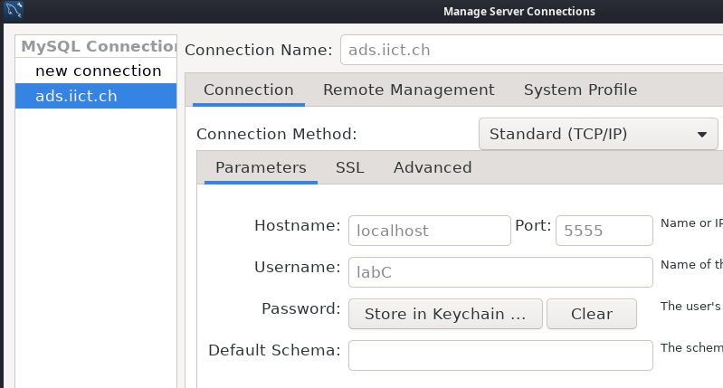
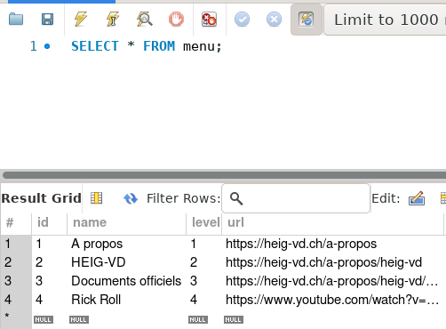

# ADS Lab 03 - Pipelines
**Authors**: Samuel Roland, Antoine Leresche, Nicolas Carbonara  
**Date**: 2025-04-06

## How to execute
As the instructions were not super clear on the source and destinations folder for each script, we explained our choice at the top of each file in the header and we automated the manual steps when needed. We wrote a basic script `deploy` to run them all locally or on the server. We didn't use the result of renamed_files as they don't appear in examples of HTML.

**Deploy the solution**

```sh
scp -r . labc0@ads.iict.ch:/home/labc0/
```

```sh
~ > bash deploy
```


**Generate all files on the server**

```sh
~ > bash deploy
```

Our page is now available at [https://ads.iict.ch/~labc0/page.html](https://ads.iict.ch/~labc0/page.html).

## Task 4 - Use SSH Tunneling
Here is the command we used to create a SSH tunel.
```sh
ssh labc0@ads.iict.ch -L 5555:localhost:3306
```




