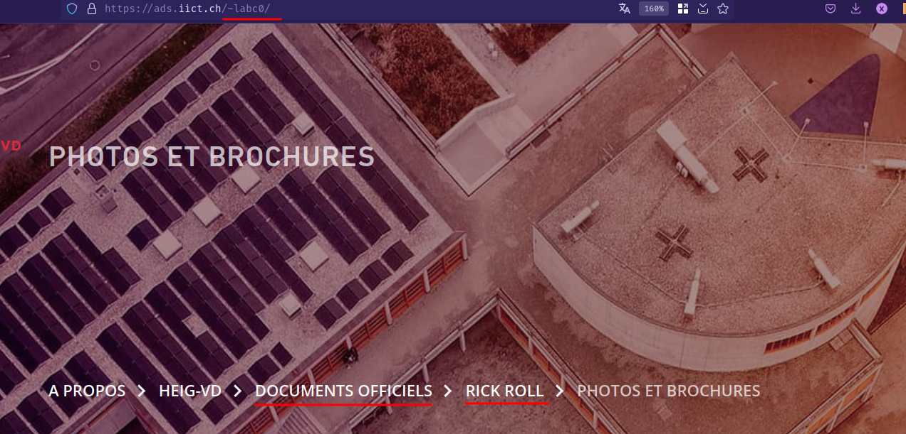

# ADS Lab 04 - Scripting
**Authors**: Samuel Roland, Antoine Leresche, Nicolas Carbonara  
**Date**: 2025-04-06

## How to execute
As the instructions were not super clear on the source and destinations folder for each script, we explained our choice at the top of each file in the header and we automated the manual steps when needed. We wrote a basic script `deploy` to run them all locally or on the server. We didn't use the result of renamed_files as they don't appear in examples of HTML.

**Preparation**  
Here is a little script to help you setup our website locally if needed. Everything is deployed, but this is also needed to run our scripts locally.
```sh
cd lab04
wget https://ads.iict.ch/lab04_template.zip
unzip lab04_template.zip
chmod u+w public_html
mv lab04_template/* public_html/
rm -f public_html/index.html

wget https://ads.iict.ch/lab04_raw_files.zip
unzip lab04_raw_files.zip
mv lab04_raw_files public_html/
```

**Run our scripts locally**

```sh
cd public_html

bash ../show_dimensions
bash ../rename_pictures
bash ../make_thumbnails
bash ../make_html
```

**Deploy the solution**

```sh
cd lab04
scp -r . labc0@ads.iict.ch:/home/labc0/
```
**Generate all files on the server**

```sh
~ > bash deploy
```

Our page is now available at [https://ads.iict.ch/~labc0/page.html](https://ads.iict.ch/~labc0/page.html).

## Task 4 - Use SSH Tunneling
Here is the command we used to create a SSH tunel.
```sh
ssh labc0@ads.iict.ch -L 5555:localhost:3306
```


We changed the deployed `index.php` with the database credentials at the top and the menu is correctly generated.


Note: The images are not linked correctly, but this was probably not asked so we focused on the `page.html`.
